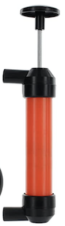

Doing your own transmission oil changes is not difficult. By this time now, you might already know about the 722.9's unique design of having no dipstick or fill tube. If you didn't know, now you know. Others might claim you will need a "somewhat expensive special tool". Yet I am here to report otherwise. Below are all the tools you will need.

### Personal Specifics
This work was done on a 2005 CLK 500 that is equipped with a 722.9 transmission. (with the white overflow pipe)
In my case, my trans oil pan's gasket wasn't leaking therefore no need to purchase a new one.
I chose the Shell ATF 134 not only for it's obvious reasons like meeting NAG2 specifications but also because it gives the best price per quart when bought in bulk.

If you have the oil pan on the right of the image than it means it's production date is as of June 21, 2010 and it's fluid specs differ from Shell ATF 134
The filling method and oil-level check for the transmission are not altered by the change in transmission oil pan (1). 
The old transmission oil pan (1) version can be recognized by the chamfer (arrow). This transmission oil pan (1) may only be installed with the white overflow pipe (2).

## Tools you'll need

1. [ATF Fill Adapter for Mercedes Benz 722.9 ⬇️](https://www.amazon.com/gp/product/B07N1DJNCK/ref=as_li_tl?ie=UTF8&camp=1789&creative=9325&creativeASIN=B07N1DJNCK&linkCode=as2&tag=milliongrad-20&linkId=8edd2f6417191c8b0d117a80f6092e2d)

2. [Multi-Purpose Siphon Transfer Pump ⬇️](https://www.amazon.com/gp/product/B076TMQGMN/ref=as_li_tl?ie=UTF8&camp=1789&creative=9325&creativeASIN=B076TMQGMN&linkCode=as2&tag=milliongrad-20&linkId=17b668ff620ea69299c2ad9746920187)

3. [E-Torx socket set ⬇️](https://www.amazon.com/gp/product/B079ZP2FM1/ref=as_li_tl?ie=UTF8&camp=1789&creative=9325&creativeASIN=B079ZP2FM1&linkCode=as2&tag=milliongrad-20&linkId=cd0f02488099c97a031b3f8499a508f0)

## Products you'll need

1. [Shell ATF 134 Mercedes Benz Transmission Fluid ⬇️](https://www.amazon.com/gp/product/B00DWFSJLC/ref=as_li_tl?ie=UTF8&camp=1789&creative=9325&creativeASIN=B00DWFSJLC&linkCode=as2&tag=milliongrad-20&linkId=7b9ccd973262e66cdf1074ff9ee6bba5)

2. [Auto Transmission Filter for Mercedes-Benz W221 W219 722.9 7-Speed ⬇️](https://www.amazon.com/gp/product/B01N1WF6ZG/ref=as_li_tl?ie=UTF8&camp=1789&creative=9325&creativeASIN=B01N1WF6ZG&linkCode=as2&tag=milliongrad-20&linkId=6a41fdef89c9bdbbdb8e7880e5086274)

## Mercedes-Benz 722.9 Transmission Service Procedure

1. The first step is to pull the drain plug. Have a container ready for the drainage. Tip: once the drain plug is loosen, remove the socket from the ratchet in order to avoid the drainage faster. Measure the drainage to get an idea of how much new fluid will have to be pumped back inside.
`video: https://youtube/embed/r_ZT1hNHuCU`
<!-- maybe add DJI_0182 video clip here @ 01:05 - 01:40  -->

2. Next, you must knock off the overflow pipe that is attached to the drain plug hole inside the pan to liberate the rest of the oil. Do this will a punch pin or anything else that can act as one.
<!-- add DJI_0182 video clip here @ 03:30 to 03:40 -->

`video: https://youtube/embed/XPhl-UL4muQ`
3. Remove the six E10 Torx screws and drop the pan. I like to remove five screws and hold the pan up with my hand when removing the last screw. This reduces the chaos that evident when the pan finally comes free.
<!-- add DJI_0184 video clip here @ 01:13 to 01:20 -->

4. Drop the filter to release more fluid. Clean up the surface that the pan gasket contacts on the transmission with a paper towel. I like the surface to be completely dry before I begin reassembly.
`video: https://www.youtube.com/embed/Ublknmx2sts`
<!-- add DJI_0184 video clip here @ 02:50 to 03:10 -->

5. Install the new filter. Wet it's o-ring with transmission oil. 
 <!-- DJI_0185.MP4 video clip here @ 00:30 - 00:54 -->
 `video: https://www.youtube.com/embed/M_UNu6HIh8Y`
6. Make sure the overflow pipe is locked back into place. 
    

7. At this point, you're ready to re-install the pan. You don't need new screws if your current ones are fine. First you want to seed all the screws all the way in without tightening them so you are able to have some wiggle adjustment movement room if needed. If no adjusting is needed, reiterate through the screws to tighten.

8. Attach the filler adapter, and attach the hose of the pump onto it. 
`video: https://www.youtube.com/embed/h4AsxeVPinM`

9. Refill using the pump, add the amount of quart that was measure from the initial drainage.
`video: https://www.youtube.com/embed/JAp-H2QoHlI`

##  Inspecting ATF Level In Automatic Transmission
1. Park vehicle on a horizontal surface.
2. Start the engine, allow it to idle and maintain pressure on the brake pedal while shifting the 
transmission through the ranges "PR- N-D"
3. Allow the engine to run in selector lever position "P" order to bring transmission oil temperature to around what it should adhere to which for the transmission oil pan with the white overflow pipe) should be 45°C/113°F
4. Carefully unscrew the oil drain screw (3) from the transmission's oil pan and observe the fluid as it emerges, then screw the oil drain screw (3) back in immediately. With an oil flow of thickness (arrow a) or thickness (arrow b) the transmission oil level is OK and does not have to be corrected. With an oil flow of thickness (arrow c) the transmission oil level must be corrected and in addition must be checked again

